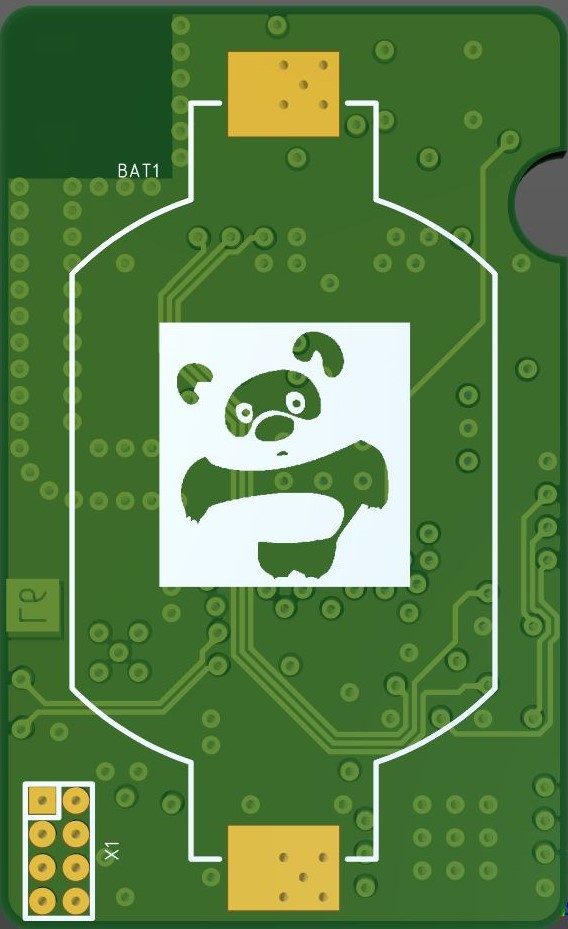

### Board view
With components 

  
  

 
Without components

  
  

 

### Programming interface

  

### Layer stackup
Board is 6 layer stackup with the following layer purpose:

  

 

Detailed information about PCB layer stackup could be find

### Layer view

  
  
  
  
  
  

### Schematics
Up to date version of schematics is 
